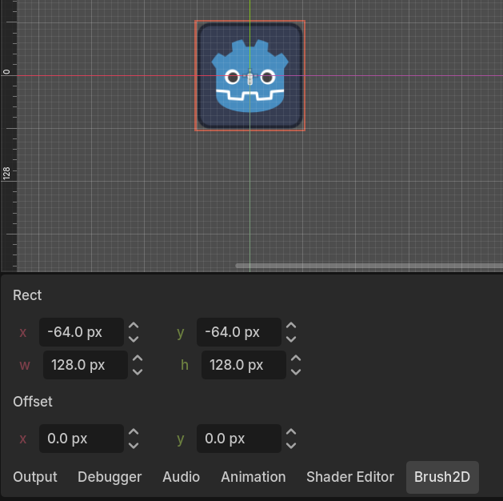
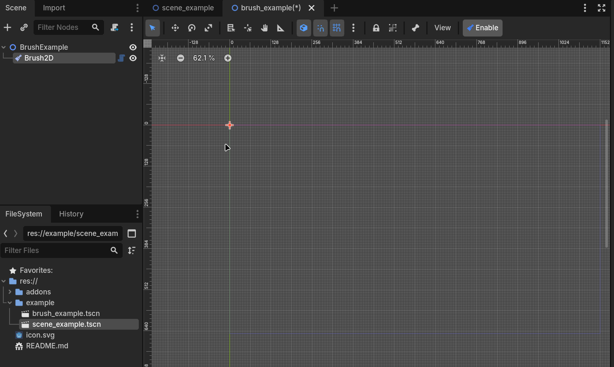
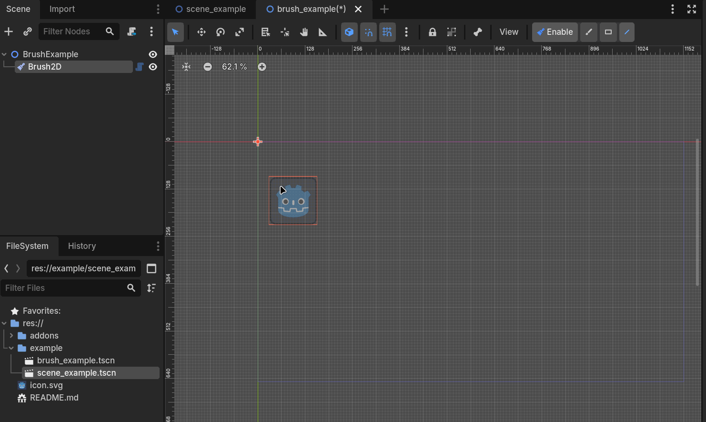
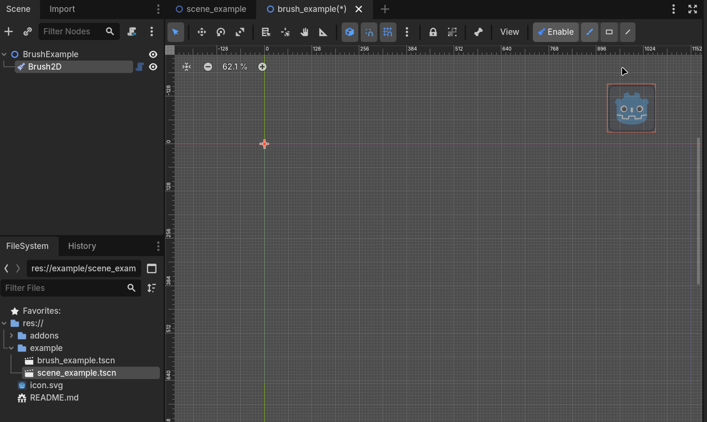
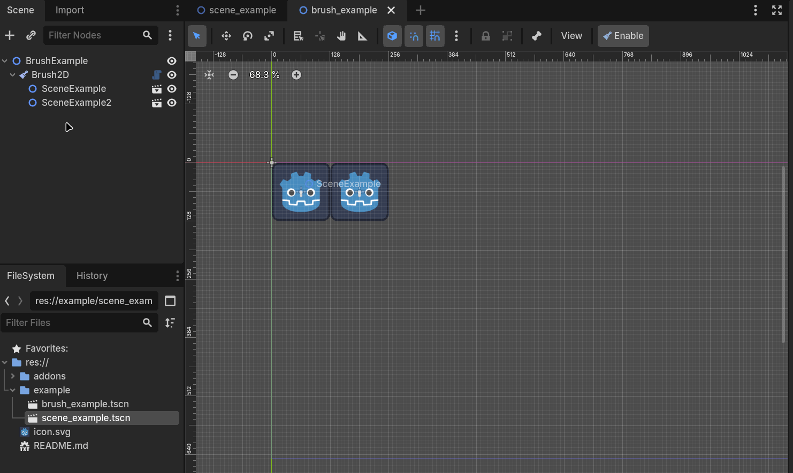

# Introduction

This is a simple addon for **Godot-v4.6.x** that can help you to easily place **PackedScene** in **2D panel**. For older Godot supports, you may check other branch.

## Usage

Here is a simple instruction:

1. Add a `Brush2D` node in the editor scene tree and select it or its child.
2. Click the **Enable** button (or use shortcut `A` by default) to switch to the **Paint Mode**.
3. Select a **PackedScene** in the filesystem dock.
4. Now you can simply use the mouse **left button** to paint or **right button** to erase.

Technically, I don't know how to get a reasonable default rect for each scene, so the recognized size of a scene has to be set manually, i.e., you need to open bottom `Brush2D` dock and change the `Rect` to cover your scene. There is also an `offset` parameter, which allows to shift the final placement, though it's alwasy possible to adjust `rect` directly.

## Features

Common `paint`, `line` and `rectangle` tools are all supported.

---

---

---

We also support simple copy and paste. To copy or cut a scene (it must be a child of current `Brush2D`), just select it and press `C` or `X`.

You may customize copy/cut shortcuts in editor settings. To customize toolbar shortcut, you may direct edit `tool_button.tscn`.

## Known issue

Since Godot does not expose `duplicate_from_editor`, copy mode may not work as expected, e.g., it may wrongly copy internal nodes, or lose some properties & signal connections.
